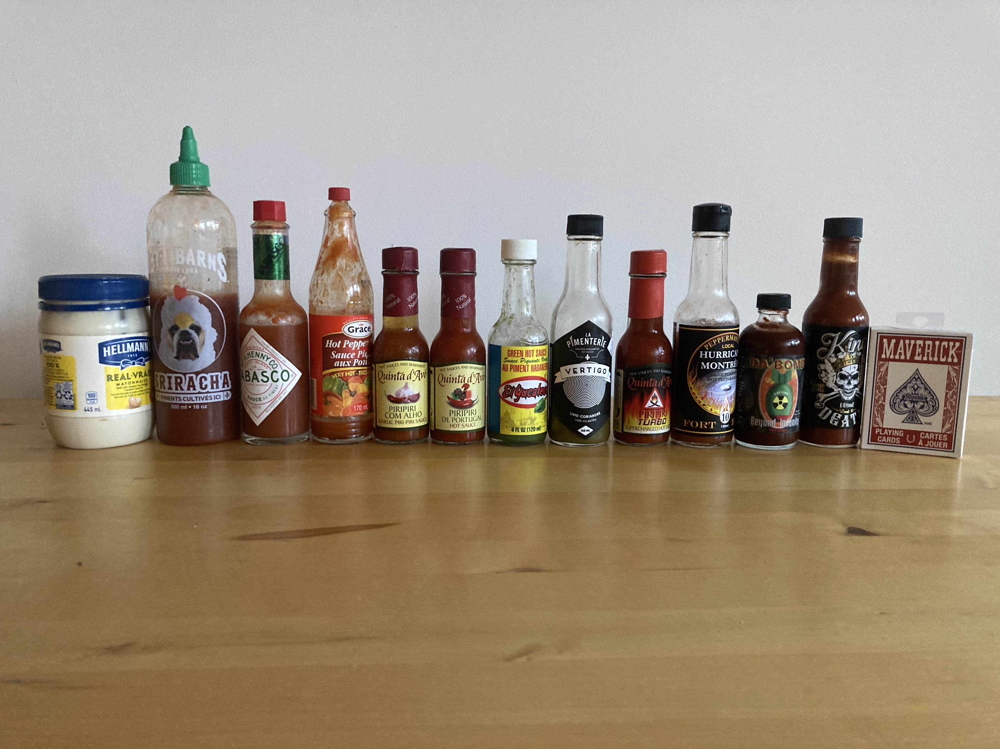

# Poker d'enfer

Un variante du [Texas hold'em](https://fr.wikipedia.org/wiki/Texas_hold%27em) qui remplace les jetons par des sauces piquantes. Fut inventé le 6 septembre 2022 par un groupe d'amis à [Montréal](https://fr.wikipedia.org/wiki/Montreal)

## Histoire

Cette variante du [Texas hold'em](https://fr.wikipedia.org/wiki/Texas_hold%27em) tient son origine d'une soirée le 6 septembre 2022 où, un groupe d'amis de longue date originaire de [Gatineau](https://fr.wikipedia.org/wiki/Gatineau) et maintenant à [Montréal](https://fr.wikipedia.org/wiki/Montreal) voulaient jouer au poker, mais n'avaient pas de jetons. Ces derniers jouent alors une partie normale, mais avec des mises fictives. Cela n'offrait pas le même niveau d'adrénaline, alors ces derniers arrêtèrent.

Plus tard dans la soirée, le groupe d'amis mangent des ailes de poulet avec leurs sauces piquantes préférées comme souper. Sans raison particulière, ceux-ci se mirent à se défier à mettre des sauces piquantes plus intenses que leurs ailes afin de montrer leur résistance aux autres membres de la bande. C'est à cet instant que l'idée de mélanger Poker et sauce piquante née.

Au fil des soirées, le groupe d'amis peaufinent les règles de ce nouveau jeu qu'ils ont inventé: Poker d'enfer. La gestion des blinds fut introduite ainsi que la variante [The final countdown](#the-final-countdown)

## Règles de base

Poker d'enfer se joue comme [Texas hold'em](https://fr.wikipedia.org/wiki/Texas_hold%27em). La seule différence est dans la nature des mises.

Des sauces piquantes sont placés au milieu de la table (laissant de la place pour les cartes). Un nombre minimale de 10 est recommandé pour offrir une progression dans les mises.

À chaque tour de mises, les joueurs peuvent soit relancer, suivre, se coucher ou parler

### Options des joueurs lors d'un tour de mises

- Relancer / To raise: consiste à miser une sauce piquante plus élevé que la mise actuelle
- Suivre / To call: consiste à rester dans la ronde à la mise actuelle
- Se coucher / To fold; consiste à abandonner pour la ronde. Il devra consommer la sauce piquante à hauteur de sa mise et pourra jouer à la ronde suivante. Voir [consommation de la sauce piquante](consommation-de-la-sauce-piquante)
- Parler / To check; consiste à rester dans la ronde à la mise actuelle à condition que personne n'ait relancé dans le tour

Blinds:

- La sauce la moins intense est le small blind
- La deuxième sauce la moins intense est le big blind

### Consommation de la sauce piquante

Chaque joueur qui s'est couché ou qui a perdu a [l'abattage](https://fr.wikipedia.org/wiki/Abattage_(poker)) soit consommé la sauce piquante de sa mise ou aucune s'il n'avait pas de blind. La sauce piquante peut être consommée telle quelle ou sur un medium comme une aile de poulet ou une chip.

## Variantes

### The final countdown

Après chaque ronde, la sauce piquante la moins intense est retirée de la partie.
